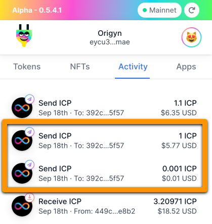
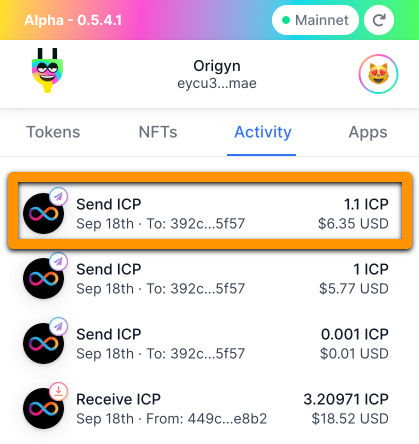

# Actual Output from Creating dfx Mainnet Identity, Cycles Wallet, & NFT Canister

```console
➜ dfx identity new jt-mainnet-Ed25519
Please enter a passphrase for your identity: [hidden]
Encryption complete.
Created identity: "jt-mainnet-Ed25519".

➜ dfx identity list
default \_
jt-mainnet-Ed25519

➜ dfx identity export jt-mainnet-Ed25519 > ./jt-mainnet-ed25519.pem
Please enter a passphrase for your identity: [hidden]
Decryption complete.

➜ dfx identity remove jt-mainnet-Ed25519
Removed identity "jt-mainnet-Ed25519".

➜ dfx identity list
default \_

➜ dfx identity import jt-mainnet-ed25519 jt-mainnet-ed25519.pem
Please enter a passphrase for your identity: [hidden]
Encryption complete.
Imported identity: "jt-mainnet-ed25519".

➜ dfx identity use jt-mainnet-ed25519
Using identity: "jt-mainnet-ed25519".

➜ dfx identity get-principal
Please enter a passphrase for your identity: [hidden]
Decryption complete.
sil2l-jnboi-ckxt5-hrc2f-pmauv-yhxdm-vujiq-rmz3k-6g6lt-pe2vn-nae

➜ dfx ledger --network ic create-canister $(dfx identity get-principal)
Please enter a passphrase for your identity: [hidden]
Decryption complete.
dfx.json not found, using default.
Please enter a passphrase for your identity: [hidden]
Decryption complete.
Error: Failed to transfer funds.
Caused by: Failed to transfer funds.
the debit account doesn't have enough funds to complete the transaction, current balance: 0.00000000 ICP

➜ dfx ledger --network ic balance
dfx.json not found, using default.
Please enter a passphrase for your identity: [hidden]
Decryption complete.
0.00000000 ICP
```

Sent 1.001 ICP from my Plug wallet to my dfx identity's account id.



```console
➜ dfx ledger --network ic balance
dfx.json not found, using default.
Please enter a passphrase for your identity: [hidden]
Decryption complete.
1.00100000 ICP

➜ dfx ledger --network ic create-canister sil2l-jnboi-ckxt5-hrc2f-pmauv-yhxdm-vujiq-rmz3k-6g6lt-pe2vn-nae --amount 1
dfx.json not found, using default.
Please enter a passphrase for your identity: [hidden]
Decryption complete.
Transfer sent at block height 4542394
Canister created with id: "k4fy2-6qaaa-aaaak-acu7a-cai"

➜ dfx ledger --network ic balance
dfx.json not found, using default.
Please enter a passphrase for your identity: [hidden]
Decryption complete.
0.00090000 ICP

➜ dfx identity --network ic deploy-wallet k4fy2-6qaaa-aaaak-acu7a-cai
dfx.json not found, using default.
Please enter a passphrase for your identity: [hidden]
Decryption complete.
Creating a wallet canister on the ic network.
The wallet canister on the "ic" network for user "jt-mainnet-ed25519" is "k4fy2-6qaaa-aaaak-acu7a-cai"

➜ dfx identity --network ic get-wallet
dfx.json not found, using default.
Please enter a passphrase for your identity: [hidden]
Decryption complete.
k4fy2-6qaaa-aaaak-acu7a-cai

➜ dfx ledger --network ic balance
dfx.json not found, using default.
Please enter a passphrase for your identity: [hidden]
Decryption complete.
0.00090000 ICP

➜ dfx canister --network ic info k4fy2-6qaaa-aaaak-acu7a-cai
dfx.json not found, using default.
Please enter a passphrase for your identity: [hidden]
Decryption complete.
Controllers: sil2l-jnboi-ckxt5-hrc2f-pmauv-yhxdm-vujiq-rmz3k-6g6lt-pe2vn-nae
Module hash: 0xbb001d1ebff044ba43c060956859f614963d05c77bd778468fce4de095fe8f92

➜ dfx wallet --network ic balance
dfx.json not found, using default.
Please enter a passphrase for your identity: [hidden]
Decryption complete.
4.314 TC (trillion cycles).

➜ dfx canister --network ic call k4fy2-6qaaa-aaaak-acu7a-cai authorize '(principal "plnha-ikxi6-647ic-nuibz-467pg-dhjt4-jshau-kx24q-whoq5-jmqch-tae")'
dfx.json not found, using default.
Please enter a passphrase for your identity: [hidden]
Decryption complete.
()
```

Sent 1.1 more ICP from my Plug wallet to my dfx identity's account id.



```console
➜ dfx ledger --network ic balance
dfx.json not found, using default.
Please enter a passphrase for your identity: [hidden]
Decryption complete.
1.10090000 ICP

➜ dfx wallet --network ic balance
dfx.json not found, using default.
Please enter a passphrase for your identity: [hidden]
Decryption complete.
4.314 TC (trillion cycles).

➜ dfx ledger --network ic top-up k4fy2-6qaaa-aaaak-acu7a-cai --amount 1
dfx.json not found, using default.
Please enter a passphrase for your identity: [hidden]
Decryption complete.
Transfer sent at block height 4542552
Error: Notify call failed.
Caused by: Notify call failed.
The replica returned an HTTP Error: Http Error: status 503 Service Unavailable, content type "application/cbor", content: Service is overloaded, try again later.

➜ dfx ledger --network ic top-up k4fy2-6qaaa-aaaak-acu7a-cai --amount 1
dfx.json not found, using default.
Please enter a passphrase for your identity: [hidden]
Decryption complete.
Error: Failed to transfer funds.
Caused by: Failed to transfer funds.
the debit account doesn't have enough funds to complete the transaction, current balance: 0.10080000 ICP

➜ dfx ledger --network ic balance
dfx.json not found, using default.
Please enter a passphrase for your identity: [hidden]
Decryption complete.
0.10080000 ICP

➜ dfx wallet --network ic balance
dfx.json not found, using default.
Please enter a passphrase for your identity: [hidden]
Decryption complete.
4.314 TC (trillion cycles).

➜ dfx ledger --network ic notify top-up 4542552 k4fy2-6qaaa-aaaak-acu7a-cai
dfx.json not found, using default.
Please enter a passphrase for your identity: [hidden]
Decryption complete.
Canister k4fy2-6qaaa-aaaak-acu7a-cai topped up with 4450700000000 cycles

➜ dfx ledger --network ic balance
dfx.json not found, using default.
Please enter a passphrase for your identity: [hidden]
Decryption complete.
0.10080000 ICP

➜ dfx wallet --network ic balance
dfx.json not found, using default.
Please enter a passphrase for your identity: [hidden]
Decryption complete.
8.765 TC (trillion cycles).

➜ dfx canister --network ic create origyn_nft_reference
Please enter a passphrase for your identity: [hidden]
Decryption complete.
Creating canister origyn_nft_reference...
origyn_nft_reference canister created on network ic with canister id: ap5ok-kqaaa-aaaak-acvha-cai

➜ dfx wallet --network ic balance
Please enter a passphrase for your identity: [hidden]
Decryption complete.
4.764 TC (trillion cycles).
```

You may have noticed that 4 trillion cycles were deducted from the cycles wallet after creating an empty canister.

By default 4 TC get transferred to the new canister. You can check that with the canister status command.

Here is the status of the same canister after fully deploying the wasm module and staging/minting the sample NFT collection.

```console
➜ dfx canister --network ic status ap5ok-kqaaa-aaaak-acvha-cai
dfx.json not found, using default.
Please enter a passphrase for your identity: [hidden]
Decryption complete.
Canister status call result for ap5ok-kqaaa-aaaak-acvha-cai.
Status: Running
Controllers: k4fy2-6qaaa-aaaak-acu7a-cai sil2l-jnboi-ckxt5-hrc2f-pmauv-yhxdm-vujiq-rmz3k-6g6lt-pe2vn-nae
Memory allocation: 0
Compute allocation: 0
Freezing threshold: 2_592_000
Memory Size: Nat(52096683)
Balance: 3_796_806_025_838 Cycles
Module hash: 0x5c59f74621142a31d2778958be1ec73dc52e22097f612f0403d6b4e7767fa3ee
```

The difference between the default 4 TC cycles transferred to the canister upon creation and the remaining cycles after deployment is -203,193,974,162 cycles (about 27 cents).